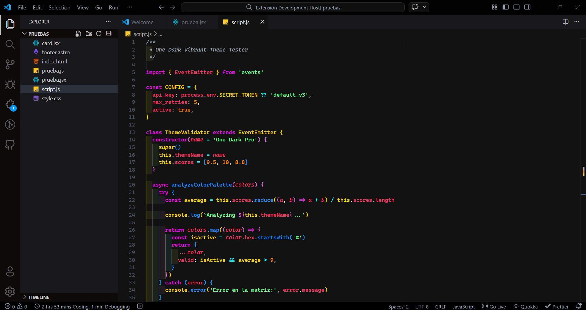

# One Dark Vibrant Theme

---

One Dark Vibrant Theme is a vibrant and colorful version of the popular One Dark theme. Based on [One Dark Darker](https://marketplace.visualstudio.com/items?itemName=JoelCrosby.one-dark-darker) by JoelCrosby and inspired by [One Dark Pro Theme](https://marketplace.visualstudio.com/items?itemName=zhuangtongfa.Material-theme), this theme features brighter and more saturated colors for a modern and eye-catching coding experience. Perfect for developers who love the One Dark aesthetic but want a more lively and dynamic look.

**Key Features:**

- Enhanced color palette for better contrast and readability.
- Optimized for modern web development (JavaScript, TypeScript, HTML, CSS).
- Perfect for long coding sessions with reduced eye strain.

## Screenshots

## Changelog

All notable changes to the **One Dark Vibrant Theme** are documented in the [CHANGELOG](CHANGELOG.md) file. Check it out to see the history of releases and improvements.

## Maintenance

This theme is actively maintained and kept compatible with the latest versions of Visual Studio Code. Minor updates may include documentation improvements, visual refinements, and general maintenance.

## License

This project is licensed under the [MIT License](LICENSE).
Copyright (c) 2025 josergz

## Contributing

Contributions are welcome! Feel free to open issues or submit pull requests to help improve this theme.

