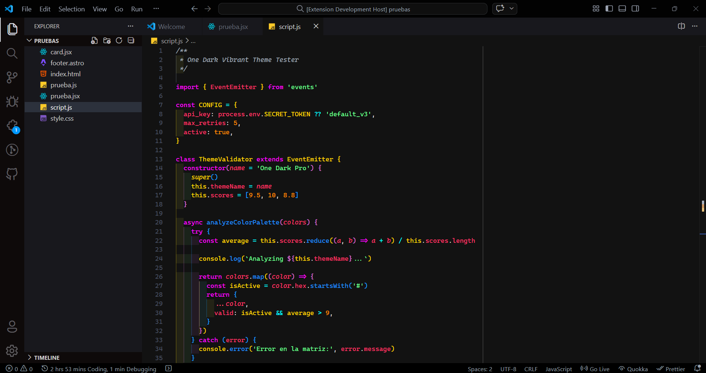

# One Dark Pro Vibrant Theme

**One Dark Pro Vibrant Theme** is a high-contrast, logically-colored evolution of the iconic **One Dark Pro** syntax. If you love the classic **One Dark Pro Theme** but crave more saturation and better syntax separation, this is your new default setup.

---

## 📸 Preview

> **Pro Tip:** For the best experience, use [Material Icon Theme](https://marketplace.visualstudio.com/items?itemName=PKief.material-icon-theme).

---

### 🎨 Credits & Inspiration

This theme is a curated evolution of the **One Dark** aesthetic. It is deeply inspired by and builds upon the excellent work of:

- **[One Dark Pro](https://marketplace.visualstudio.com/items?itemName=zhuangtongfa.Material-theme):** The gold standard for dark themes.
- **[One Dark Darker](https://marketplace.visualstudio.com/items?itemName=JoelCrosby.one-dark-darker):** For its deep, focused background tones.

---

## ✨ Why One Dark Pro Vibrant Theme?

Unlike other **One Dark** variations, this version is fine-tuned for the modern web ecosystem (**Astro**, **React**, **TypeScript**). It’s not just about "more color"; it's about **visual hierarchy**.

- 🌈 **Vibrant Syntax:** Saturated tones that make your code "pop" without sacrificing readability.
- ⚛️ **Modern Stack Support:** Custom-tailored highlighting for **TypeScript**, **React (JSX/TSX)**, **Astro**, and **Tailwind CSS**.
- 👁️ **Eye-Comfort:** Designed for long-haul sessions, reducing strain through optimized contrast ratios.

## 🚀 Optimized for your Workflow

This **One Dark Pro** extension provides a superior experience for:

- **Frontend Devs:** Deep support for CSS/SCSS and Tailwind classes.
- **TS Wizards:** Precise highlighting for Union Types, Interfaces, and Enums.
- **Minimalists:** A clean, ordered UI that stays out of your way.

## 🛠 Maintenance & Updates

This theme is actively maintained and kept compatible with the latest versions of Visual Studio Code. Minor updates may include documentation improvements, visual refinements, and general maintenance.

## 📜 License

This project is licensed under the [MIT License](LICENSE).  
Copyright (c) 2026 **josergz**
